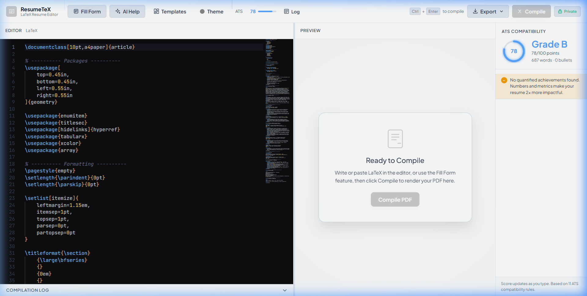
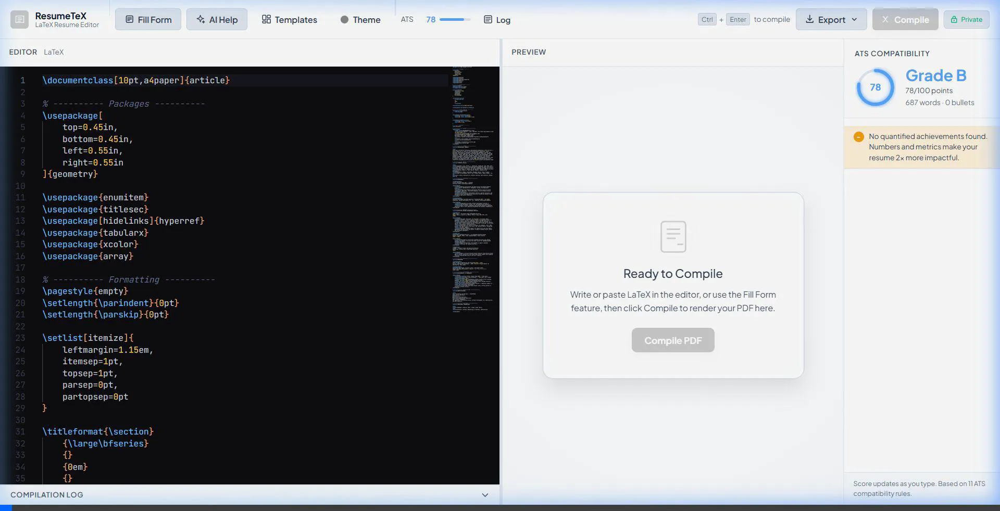

# ResumeTeX

A professional, AI-powered LaTeX resume editor built for the browser. No login required. No data stored on any server. 

ResumeTeX is specifically built to be the ultimate resume builder, combining the pixel-perfect formatting of LaTeX with the ease of AI generation and real-time ATS scoring.

**Live site:** https://navaneethan-p.github.io/ResumeTeX

---

## See it in Action



*Watch the video demo below to see the AI features and Theme switching in action:*



---

## Why ResumeTeX beats Overleaf (for Resumes)

While Overleaf is fantastic for general-purpose research papers, ResumeTeX is purpose-built to get you hired. Here is why ResumeTeX is better for building resumes:

| Feature | ResumeTeX | Overleaf |
|---|---|---|
| **AI Prompt Generation** | Built-in form to generate structured AI prompts to write your resume | ❌ None |
| **AI Customization Assistant** | Sidebar with 1-click prompt templates to change fonts, colors, and layout | ❌ None |
| **ATS Scoring** | Built-in real-time ATS compatibility checker (11 rules) | ❌ None |
| **Templates & Themes** | 6 curated templates and 15 color themes applied instantly with 1-click | ❌ Manual setup required |
| **Privacy & Accounts** | No login required. Total privacy. | ⚠️ Account required, data stored on their servers |
| **Encryption** | Client-side AES-256-GCM encryption for downloaded `.tex` files | ❌ None |
| **File Size** | Lightweight, lightning fast | ⚠️ Heavy, general purpose |

---

## Features

- Monaco code editor with LaTeX syntax highlighting and autocomplete
- Fill Form that generates a structured AI prompt — paste into ChatGPT or Claude to get complete LaTeX code
- AI Help Sidebar to instantly copy prompts for deep LaTeX customizations
- Premium White/Light UI with glassmorphism design
- Live PDF compilation via latex.online (no backend required)
- 6 professionally designed resume templates
- 15 color themes applied to both the UI and your LaTeX document
- ATS compatibility scorer with 11 rules and actionable suggestions
- Export as PDF, raw .tex file, clipboard copy, or AES-256-GCM encrypted .tex file
- Resizable split-pane editor and preview
- Client-side end-to-end encryption using the native Web Crypto API

---

## How to Use (Live)

1. Open https://navaneethan-p.github.io/ResumeTeX in any modern browser
2. Start typing LaTeX directly, or click **Fill Form** to use the AI workflow:
   - Fill in your resume details (leave fields blank to skip)
   - Click **Generate AI Prompt**
   - Click **Copy Prompt** and paste it into ChatGPT, Claude, or any AI assistant
   - The AI will return complete LaTeX code
   - Click **Paste AI Response**, paste the code, and click **Use in Editor**
3. Need to tweak something? Click **AI Help** in the header to get prompts for changing fonts, colors, or adding sections.
4. Customize using the Templates and Theme pickers.
5. Press **Ctrl+Enter** or click **Compile** to render a PDF preview.
6. Use **Export** to download your PDF, .tex file, or an encrypted copy.

---

## Run Locally

### Requirements

- Node.js 18 or higher
- npm

### Steps

```bash
# Clone the repository
git clone https://github.com/Navaneethan-P/ResumeTeX.git
cd ResumeTeX

# Install dependencies
npm install

# Start the development server
npm run dev
```

Open http://localhost:5173/ResumeTeX/ in your browser.

### Build for production

```bash
npm run build
```

The production build is output to the `dist/` directory and can be served from any static host.

---

## LaTeX Compilation

The editor sends your LaTeX source to the [latex.online](https://latex.online) free public API for compilation. If that service is unavailable, a robust iframe fallback is utilized to ensure compilation succeeds even with strict CORS policies.

To compile entirely offline, copy your `.tex` source and compile locally with:

```bash
pdflatex resume.tex
```

---

## Encryption

When you use **Download Encrypted .tex**, your document is encrypted entirely in your browser using AES-256-GCM via the Web Crypto API before any file is written. The platform never sends or stores your document content.

To decrypt an encrypted file, use the built-in load feature and enter your passphrase. If you lose your passphrase, the file cannot be recovered — the platform has no access to it.

---

## Templates

| Name | Best For | ATS Rating |
|---|---|---|
| Modern Minimal | General / Tech | High |
| Corporate Traditional | Finance / Law / Consulting | High |
| Creative Design | Design / Marketing / Media | Medium |
| Academic CV | Research / Academia | High |
| Technical / Engineering | Engineering / DevOps | High |
| Executive | Senior Leadership / C-Suite | High |

---

## Technology Stack

| Layer | Technology |
|---|---|
| Framework | React 18 + Vite |
| Code Editor | Monaco Editor (@monaco-editor/react) |
| State | Zustand |
| Encryption | Web Crypto API (AES-256-GCM, PBKDF2) |
| LaTeX Compilation | latex.online public API |
| Styling | Vanilla CSS with CSS custom properties |
| Deployment | GitHub Pages via GitHub Actions |

---

## License

MIT License. See [LICENSE](./LICENSE) for full text.

---

## Creator

**Navaneethan P**

GitHub: https://github.com/Navaneethan-P
